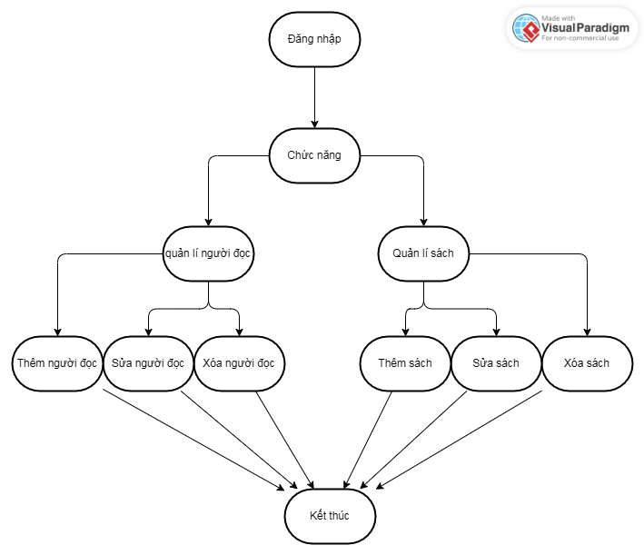

### OOP_N02_Groupx
## Thành Viên
1. Nguyễn Công Phước
2. Lê Minh Đức

### Ứng Dụng: Quản lí thư viện
1. Các đối tượng
   sách, thành viên, nhân viên, mượn sách
2. Phân tích các đối tượng
    - Sách
      + Mã sách: mã số của một sách duy nhất
      + Tên sách: tên sách, có thể dùng để tìm kiếm
      + Nhà xuất bản:
      + Năm xuất bản
      + Trạng thái sách : đã mượn, có sẵn
    - Thành viên:
      + mã số thành viên
      + họ và tên
      + số điện thoại
      + địa chỉ
      + địa chỉ mail
      + sách mượn
   - Nhân viên:
     + mã nhân viên
     + tên nhân viên
     + số điện thoại nhân viên
     + danh sách các cuốn sách
  - Mượn sách:
    + Mã mượn sách
    + Tên sách mượn
    + Thành viên mượn
    + Ngày mượn
    + Ngày trả
    + Ngày trả thực tế
  #### Sơ đồ quản lí
  
   

